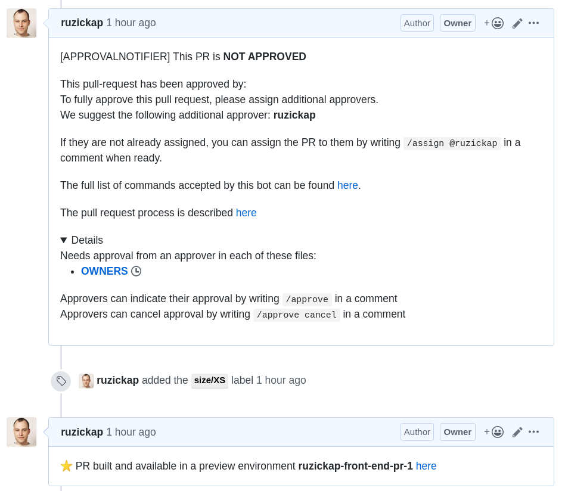
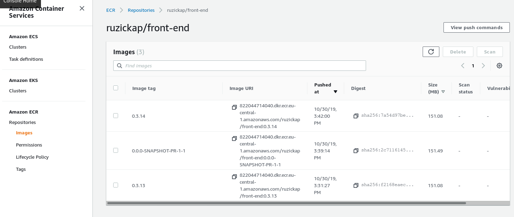

# Jenkins X operations

Let's try to do some modifications in the `front-end` application and see how
the Jenkins X will react on changes in git repository.

## Pull Request

Create Pull Request (PR):

```bash
cd tmp/front-end
git checkout -b my_change
sed -i "s/We love socks/We really love socks/" public/index.html
git diff
git commit -s -a -m "String changed"
git push origin my_change
```

Output:

```text
Switched to a new branch 'my_change'
─────────────────────────────────────────────────────────────────────────────────────────────────────────────────────────────────────────────────────────────────────────────────────────────
modified: public/index.html
─────────────────────────────────────────────────────────────────────────────────────────────────────────────────────────────────────────────────────────────────────────────────────────────
@ public/index.html:86 @ _________________________________________________________ -->
                            <div class="icon"><i class="fa fa-heart"></i>
                            </div>

                            <h3><a href="#">We love socks!</a></h3>
                            <h3><a href="#">We really love socks!</a></h3>
                            <p>Fun fact: Socks were invented by woolly mammoths
                                to keep warm. They died out because stupid
                                humans had to cut their legs off to get their
[my_change c5ce0d8] String changed
 1 file changed, 1 insertion(+), 1 deletion(-)
Enumerating objects: 7, done.
Counting objects: 100% (7/7), done.
Delta compression using up to 4 threads
Compressing objects: 100% (4/4), done.
Writing objects: 100% (4/4), 383 bytes | 383.00 KiB/s, done.
Total 4 (delta 3), reused 0 (delta 0)
remote: Resolving deltas: 100% (3/3), completed with 3 local objects.
remote:
remote: Create a pull request for 'my_change' on GitHub by visiting:
remote:      https://github.com/ruzickap/front-end/pull/new/my_change
remote:
To https://github.com/ruzickap/front-end.git
 * [new branch]      my_change -> my_change
```

Create PR to the `fron-end` master

```bash
hub pull-request -m "My test PR" -b master
```

Output:

```text
https://github.com/ruzickap/front-end/pull/1
```

Check how the PR looks like: [https://github.com/ruzickap/front-end/pull/1](https://github.com/ruzickap/front-end/pull/1)

Look at the build logs for this PR:

```bash
jx get build logs --wait=true ruzickap/front-end/pr-1
```

Output:

```text
Build logs for ruzickap/front-end/pr-1 #1 serverless-jenkins
...
Preview application is now available at: http://front-end.jx-ruzickap-front-end-pr-1.mylabs.dev
```

New `pipelinerun` were created:

```bash
kubectl get pipelinerun | grep front-end-pr
```

Output:

```text
meta-ruzickap-front-end-pr-1-se-1         43m
ruzickap-front-end-pr-1-serverl-1         43m
```

Jenkins X created special namespace for this temporary "front-end" inside PR:

```bash
kubectl get all --namespace jx-ruzickap-front-end-pr-1
```

Output:

```text
NAME                                   READY   STATUS    RESTARTS   AGE
pod/preview-preview-774bb76d75-xqwj7   1/1     Running   0          42m

NAME                TYPE        CLUSTER-IP      EXTERNAL-IP   PORT(S)   AGE
service/front-end   ClusterIP   100.69.62.155   <none>        80/TCP    42m

NAME                              READY   UP-TO-DATE   AVAILABLE   AGE
deployment.apps/preview-preview   1/1     1            1           42m

NAME                                         DESIRED   CURRENT   READY   AGE
replicaset.apps/preview-preview-774bb76d75   1         1         1       42m
```

Check the link in the PR web page [https://front-end.jx-ruzickap-front-end-pr-1.mylabs.dev/](https://front-end.jx-ruzickap-front-end-pr-1.mylabs.dev/)
and you should see the "We really love socks!":

```bash
curl -sk https://front-end.jx-ruzickap-front-end-pr-1.mylabs.dev/ | grep "love socks"
```

Output:

```html
                            <h3><a href="#">We really love socks!</a></h3>
```

Here is the screenshot:



## Merge

Let's merge the PR to the `master`:

```bash
git checkout master
git merge my_change --no-ff -m "Merge pull request #1 from ruzickap"
git push
```

Output:

```text
Switched to branch 'master'
Your branch is up to date with 'origin/master'.
Merge made by the 'recursive' strategy.
 public/index.html | 2 +-
 1 file changed, 1 insertion(+), 1 deletion(-)
Enumerating objects: 1, done.
Counting objects: 100% (1/1), done.
Writing objects: 100% (1/1), 233 bytes | 233.00 KiB/s, done.
Total 1 (delta 0), reused 0 (delta 0)
To https://github.com/ruzickap/front-end.git
   6bb2945..d88a84b  master -> master
```

This will trigger another build:

```bash
jx get build logs --wait=true "ruzickap/front-end/master #2 release"
sleep 10
```

Output:

```text
Build logs for ruzickap/front-end/master #2 release
...
Pull Request https://github.com/ruzickap/environment-mylabs-staging/pull/2 is merged at sha cfe0935b9f327923a37d3f46fd9433559e2b3144
Pull Request merged but we are not waiting for the update pipeline to complete!
```

Check if the staging was changed after successful merge [http://front-end.jx-staging.mylabs.dev](http://front-end.jx-staging.mylabs.dev)
and you should see the "We really love socks!".

The production should not be affected by the PR merge.

```bash
curl -sk http://front-end.jx-staging.mylabs.dev | grep "love socks"
```

Output:

```html
                            <h3><a href="#">We really love socks!</a></h3>
```

You should see the change by opening [http://front-end.jx-staging.mylabs.dev](http://front-end.jx-staging.mylabs.dev).

```bash
jx promote front-end --build="2" --version 0.3.14 --env production --batch-mode=true
```

Output:

```text
WARNING: prow based install so skip waiting for the merge of Pull Requests to go green as currently there is an issue with gettingstatuses from the PR, see https://github.com/jenkins-x/jx/issues/2410
Promoting app front-end version 0.3.14 to namespace jx-production
Created Pull Request: https://github.com/ruzickap/environment-mylabs-production/pull/2
WARNING: failed to parse git provider URL git@github.com:ruzickap/k8s-jenkins-x.git: parse git@github.com:ruzickap/k8s-jenkins-x.git: first path segment in URL cannot contain colon
Pull Request https://github.com/ruzickap/environment-mylabs-production/pull/2 is merged at sha efbb7115c326151b691849561453d57f2e46f4b2
Pull Request merged but we are not waiting for the update pipeline to complete!
```

The promotion to production should be completed soon:

```bash
jx get activity
sleep 60
```

Output:

```text
...
ruzickap/k8s-jenkins-x/master #1                                          Running Version: 0.3.13
  Release                                                 13m18s     1m0s Succeeded
  Promote: production                                     12m18s     1m7s Succeeded
    PullRequest                                           12m18s     1m7s Succeeded  PullRequest: https://github.com/ruzickap/environment-mylabs-production/pull/1 Merge SHA: b84c82ec3faf8536409aca200c2067281ccdb745
    Update                                                11m11s       0s Succeeded
ruzickap/k8s-jenkins-x/master #2                                          Running Version: 0.3.14
  Release                                                  2m27s     1m0s Succeeded
  Promote: production                                      1m27s     1m7s Succeeded
    PullRequest                                            1m27s     1m7s Succeeded  PullRequest: https://github.com/ruzickap/environment-mylabs-production/pull/2 Merge SHA: efbb7115c326151b691849561453d57f2e46f4b2
    Update                                                   20s       0s Succeeded
    Promoted                                                 20s       0s Succeeded  Application is at: http://front-end.jx-production.mylabs.dev
```

You should see the "production change" by opening [http://front-end.jx-production.mylabs.dev](http://front-end.jx-production.mylabs.dev).

Here is how the AWS ECR looks like at the end:


